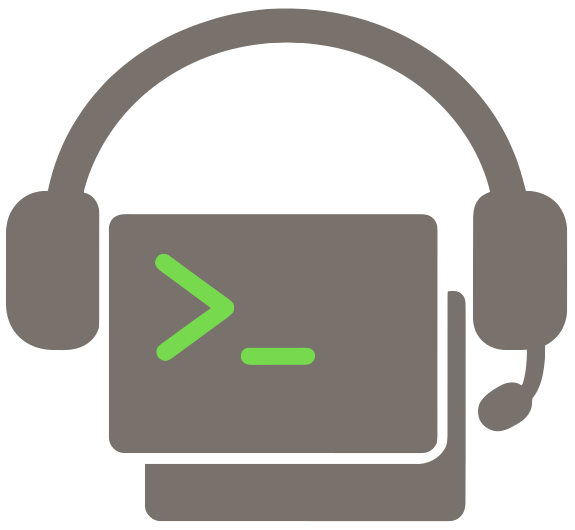

<h1 align="center">groundcrew</h1>
<p align="center">
  
</p>

Watch a Linear project and farm out ready tickets to coding-agent CLIs running in workspaces backed by git worktrees. Workspaces are [`cmux`](https://github.com/clayton-cole/cmux) panes on macOS or `tmux` windows on Linux/macOS.

## Install

```bash
npm install -g @clipboard-health/groundcrew
```

This installs the `crew` binary. `@clipboard-health/clearance` is pulled in transitively and provides the `clearance` / `clearance-ensure` bins used by local Safehouse execution.

## Quickstart

1. **Install prereqs.** Node 24, `git`, `cmux` _or_ `tmux`, and the agent CLIs themselves (`claude`, `codex`, `cursor-agent`, ...). Local runs require macOS with [Safehouse](https://agent-safehouse.dev/) on `PATH`; Linux/WSL hosts must run tickets through the configured remote runner by adding the `agent-remote` label. Sprite is currently the only remote provider. Optional: `codexbar` for session-usage gating. The `workspaceKind` config key picks the workspace backend (`auto` resolves to cmux when installed, else tmux).

2. **Create a Linear project to scope your work.** Any team works — make a project inside it and drop tickets in. The orchestrator polls by project, not by team, so you don't need a dedicated team.

3. **Create your config.** Copy the shipped example into the XDG config path and edit it:

   ```bash
   mkdir -p "${XDG_CONFIG_HOME:-$HOME/.config}/groundcrew"
   cp "$(npm root -g)/@clipboard-health/groundcrew/configExample.ts" \
      "${XDG_CONFIG_HOME:-$HOME/.config}/groundcrew/config.ts"
   $EDITOR "${XDG_CONFIG_HOME:-$HOME/.config}/groundcrew/config.ts"
   ```

   At minimum set `linear.projectSlug` (paste the trailing segment of your Linear project URL, e.g. `ai-strategy-5152195762f3`), `workspace.projectDir`, and `workspace.knownRepositories`. Everything else has a default.

   Create `workspace.projectDir` if it does not exist, and clone each repo in `workspace.knownRepositories` into `<projectDir>/<repo>` before the first `crew run`. Groundcrew creates per-ticket worktrees from these clones; it does not auto-clone. Use the literal `knownRepositories` string as the path under `projectDir` — `"owner/repo"` lives at `<projectDir>/owner/repo`, bare `"repo"` lives at `<projectDir>/repo`.

   ```bash
   mkdir -p ~/dev/groundcrew-workspaces
   gh repo clone owner/repo ~/dev/groundcrew-workspaces/owner/repo
   ```

   `crew` resolves the config path as: `GROUNDCREW_CONFIG` if set → `${XDG_CONFIG_HOME:-$HOME/.config}/groundcrew/config.ts` if it exists → a `config.ts` sitting next to `crew`'s own source files (only useful from a local checkout; see [Hacking on groundcrew](#hacking-on-groundcrew)). Set `GROUNDCREW_CONFIG` only when you want to override the XDG location.

4. **Provide a Linear API key.** `crew` expects `LINEAR_API_KEY` in its environment. Any mechanism works — shell export, [direnv](https://direnv.net/), a `.env` file you `source`, or piping through `op run` if you store the credential in 1Password:

   ```bash
   # Direct
   export LINEAR_API_KEY="lin_api_..."
   crew doctor

   # Via 1Password CLI (`op`), if you keep the key in a vault
   echo "LINEAR_API_KEY='op://<vault>/LINEAR_API_KEY/credential'" > .env.1password
   op run --env-file .env.1password -- crew doctor
   ```

5. **Prepare the runner and agent auth.** Groundcrew supports one local runner and one remote runner:
   - macOS local: `cmux` or `tmux` workspace, Safehouse on `PATH`, `clearance`, and locally authenticated agent CLIs.
   - macOS remote: local `cmux` or `tmux` workspace that launches the configured remote runner.
   - Linux/WSL remote: `tmux` workspace that launches the configured remote runner. Label tickets `agent-remote`; local execution is not supported.

   Local setup fails before creating a worktree when the host is not macOS or `safehouse` is missing. `models.isolation`, per-model `isolation`, and per-model `sandbox` are legacy keys and now fail config validation.

6. **Set the clearance allowlist for local macOS runs.** Groundcrew starts `clearance` from `@clipboard-health/clearance` on `http://127.0.0.1:19999` (skipping the launch if something is already listening) and runs the agent through the bundled `safehouse-clearance` wrapper. Clearance refuses to start without an allowlist — see [its README](../clearance/README.md) for the proxy's env vars, log paths, and DNS rules. The shortest path is to set the env before `crew run`:

   ```bash
   CLEARANCE_ALLOW_HOSTS="api.openai.com,auth.openai.com,api.anthropic.com,mcp.linear.app,api.linear.app" \
   crew run --watch
   ```

   Groundcrew also ships a starter allowlist file covering model APIs, Linear, Notion, Slack, Datadog, GitHub, npm, and common dev tooling at `$(npm root -g)/@clipboard-health/groundcrew/clearance-allow-hosts`. Point clearance at it (and optionally a personal file) via `CLEARANCE_ALLOW_HOSTS_FILES`:

   ```bash
   CLEARANCE_ALLOW_HOSTS_FILES="$(npm root -g)/@clipboard-health/groundcrew/clearance-allow-hosts:$HOME/.config/clearance/personal-allow-hosts" \
   crew run --watch
   ```

   Watch `${XDG_CACHE_HOME:-$HOME/.cache}/clearance/clearance.log` for `DENY` lines and add only the domains your agents actually need.

7. **Optional: prepare a remote runner.** The current remote provider is Sprite, so setup is intentionally explicit: choose which agent CLIs and MCP servers to authenticate. `--mcp` only adds the servers you name; it does not attempt to authenticate every MCP server visible in your Claude account.

   ```bash
   crew remote setup crew-claude-1 \
     --claude \
     --codex \
     --copy-local-codex-auth \
     --github \
     --git-name "Rocky Warren" \
     --git-email "1085683+therockstorm@users.noreply.github.com" \
     --mcp linear \
     --mcp slack \
     --checkpoint
   ```

   Known MCP aliases are `linear`, `slack`, and `notion`. For another HTTP MCP server, pass `--mcp name=https://example.com/mcp`. The command creates the remote runner if needed, prepares `~/dev`, configures Git, runs selected auth flows, adds selected MCP servers to Claude Code, and then opens Claude so you can run `/mcp` and authenticate only those selected servers. With the Sprite provider, `--copy-local-codex-auth` copies `${CODEX_HOME:-$HOME/.codex}/auth.json` into `/home/sprite/.codex/auth.json` and then verifies `codex login status`; it never prints the file contents. Use `--skip-mcp-auth` when you only want to add MCP definitions, and run the `/mcp` step later.

   Repo setup is separate from runner setup and should run after the ticket branch exists, immediately before launching an agent. It clones/fetches the repo in the remote runner, checks out the requested branch (creating it from the base branch when it does not exist on origin), forwards only build-time secrets for the dependency install, removes the temporary secret file, clears those env vars, and then exits. It uses groundcrew's remote setup command.

   ```bash
   op run --env-file "${XDG_CONFIG_HOME:-$HOME/.config}/groundcrew/op.env" -- \
     crew remote bootstrap crew-claude-1 core-utils --branch rocky-team-123
   ```

   By default bootstrap forwards any locally set `NPM_TOKEN` and `BUF_TOKEN`. Use repeated `--secret <ENV_NAME>` to require a specific set, or `--no-secrets` for public installs. Do not checkpoint after repo bootstrap; dependency state is branch-specific and should be refreshed per ticket.

   To run a ticket remotely through the orchestrator or `crew run --ticket`, label it with `agent-remote` plus the agent label you want, for example `agent-claude` or `agent-codex`. `agent-remote` alone uses `models.default`. Groundcrew keeps cmux/tmux local, creates a per-ticket git worktree in the remote runner under `remote.worktreeRoot`, and asks the configured provider to launch the agent. The Sprite provider emits `sprite exec --tty`. Use `crew remote sessions [<runner-name>]` to inspect active remote sessions and `crew remote attach <session-id-or-command> [--runner <runner-name>]` to attach to one; both commands default to `remote.runnerName` when the runner name is omitted.

8. **Run.** Doctor first, then a dry run, then the real thing:

   ```bash
   crew doctor
   crew run --dry-run
   crew run            # one-shot
   crew run --watch    # poll forever
   ```

## Config reference

Required fields are marked **required**; everything else has a default and can be omitted from `config.ts`.

| Key                                     | Default                               | What it does                                                                                                                                                                                                                                                    |
| --------------------------------------- | ------------------------------------- | --------------------------------------------------------------------------------------------------------------------------------------------------------------------------------------------------------------------------------------------------------------- |
| `linear.projectSlug`                    | **required**                          | Linear project URL slug (e.g. `ai-strategy-5152195762f3`). The trailing 12-char hex `slugId` is what's matched against Linear's API; the leading name keeps `config.ts` self-documenting and the lookup survives project renames.                               |
| `linear.statuses.todo`                  | `"Todo"`                              | Status name picked up for new work.                                                                                                                                                                                                                             |
| `linear.statuses.inProgress`            | `"In Progress"`                       | Status set after a workspace is provisioned; counts toward `maximumInProgress`.                                                                                                                                                                                 |
| `linear.statuses.done`                  | `"Done"`                              | Status that triggers worktree cleanup.                                                                                                                                                                                                                          |
| `linear.statuses.terminal`              | `["Done"]`                            | Additional status names treated as terminal for cleanup, board remaining counts, and blocker checks. The `done` status is always included.                                                                                                                      |
| `git.remote`                            | `"origin"`                            | Remote used for `fetch` and as the worktree base ref.                                                                                                                                                                                                           |
| `git.defaultBranch`                     | `"main"`                              | Branch fetched from `git.remote` and used as the worktree base.                                                                                                                                                                                                 |
| `workspace.projectDir`                  | **required**                          | Parent dir for cloned repos and local sibling ticket worktrees. Remote ticket worktrees live in `remote.worktreeRoot` on the remote runner.                                                                                                                     |
| `workspace.knownRepositories`           | **required**                          | Repos searched for in ticket descriptions to infer where work belongs. A ticket labeled for groundcrew (`agent-*`) fails fast when no known repo appears; unlabeled tickets are ignored.                                                                        |
| `orchestrator.maximumInProgress`        | `4`                                   | Cap on tickets in `linear.statuses.inProgress` at once.                                                                                                                                                                                                         |
| `orchestrator.pollIntervalMilliseconds` | `120_000`                             | Poll interval in `--watch` mode.                                                                                                                                                                                                                                |
| `orchestrator.sessionLimitPercentage`   | `85`                                  | Number in `(0, 100]`. A model whose codexbar session window exceeds this percentage is skipped that tick.                                                                                                                                                       |
| `models.default`                        | `"claude"`                            | Tiebreak for `agent-any` resolution and fallback for explicit but unknown `agent-*` labels. Also used by `crew setup <TICKET>` for unlabeled tickets. `crew run` ignores unlabeled tickets and does not apply this default. Must exist in `models.definitions`. |
| `models.definitions`                    | `{ claude, codex }`                   | Agent definitions. Additive merge with shipped defaults.                                                                                                                                                                                                        |
| `models.definitions.<name>.cmd`         | —                                     | Shell command launched for the model. Local macOS runs execute in the worktree through Safehouse/clearance; remote runs execute inside the remote worktree. `{{worktree}}` is replaced before launch and legacy `{{sandbox}}` expands to an empty string.       |
| `models.definitions.<name>.color`       | —                                     | Color for the workspace status pill (cmux only; tmux silently drops it).                                                                                                                                                                                        |
| `models.definitions.<name>.usage`       | optional                              | If set, codexbar usage is fetched for this model and gated by `sessionLimitPercentage`. Omit to never gate. When `usage.codexbar.source` is omitted, groundcrew uses `auto` on macOS and `cli` elsewhere.                                                       |
| `prompts.initial`                       | (template)                            | First message sent to the agent. Placeholders: `{{ticket}}`, `{{worktree}}`, `{{title}}`, `{{description}}`.                                                                                                                                                    |
| `workspaceKind`                         | `"auto"`                              | Terminal session manager. `"auto"` picks `cmux` when on PATH, else `tmux`. Set to `"cmux"` or `"tmux"` to fail loudly when the chosen backend is missing. tmux windows live in a dedicated `groundcrew` session.                                                |
| `remote.provider`                       | `"sprite"`                            | Remote runner provider used for tickets labeled `agent-remote`. Sprite is currently the only provider.                                                                                                                                                          |
| `remote.runnerName`                     | `"crew-claude-1"`                     | Remote runner used for tickets labeled `agent-remote`.                                                                                                                                                                                                          |
| `remote.owner`                          | `"ClipboardHealth"`                   | GitHub owner used when cloning bare repository names inside the remote runner.                                                                                                                                                                                  |
| `remote.repoRoot`                       | `"/home/sprite/dev"`                  | Shared clone root inside the remote runner.                                                                                                                                                                                                                     |
| `remote.worktreeRoot`                   | `"/home/sprite/groundcrew/worktrees"` | Per-ticket remote worktree root inside the remote runner.                                                                                                                                                                                                       |
| `remote.secretNames`                    | `["NPM_TOKEN", "BUF_TOKEN"]`          | Build-only env vars that may be uploaded for remote dependency setup, then unset before the agent process starts.                                                                                                                                               |
| `logging.file`                          | XDG state path                        | Append-mode log file destination. `log()` / `logEvent()` tee here in addition to stdout, so a vanished workspace doesn't take the evidence with it. Defaults to `${XDG_STATE_HOME:-$HOME/.local/state}/groundcrew/groundcrew.log`.                              |

The branch prefix (`<prefix>-<TICKET>`) is derived from your OS username (`os.userInfo().username`), not configured. Agent selection looks for a top-level Linear label named `agent-<model>` (e.g. `agent-claude`, `agent-codex`). Add `agent-remote` to run that ticket in the configured remote runner instead of locally; `agent-remote` is a modifier label, not a model. **`crew run` only fetches tickets with an `agent-*` label** — the GraphQL query filters them server-side, so unlabeled tickets are never returned by Linear's API and do not appear in the rendered board. Use `crew setup <TICKET>` to provision an unlabeled ticket on demand (manual setup falls back to `models.default`). The reserved label `agent-any` routes the ticket to the configured model with the most available session capacity (lowest codexbar session-used percent), skipping any model already over `sessionLimitPercentage`. With no usage data, `agent-any` resolves to `models.default`. The name `any` cannot be used in `models.definitions`. Todo tickets blocked by Linear issues that are not in `linear.statuses.terminal` are skipped until their blockers reach a terminal status.

### Disabling a shipped default

Groundcrew ships with `claude` and `codex` as default model definitions. If you only ever route work through one of them, disable the other so `crew doctor` stops probing for the unused CLI:

```ts
// config.ts
export const config = {
  // …
  models: {
    default: "claude",
    definitions: {
      codex: { disabled: true },
    },
  },
};
```

Rules:

- Shipped defaults (`claude`, `codex`) are the only models that accept `disabled: true`.
- It cannot be combined with `cmd`, `color`, or `usage` overrides in the same entry.
- `models.default` must point at an enabled model.

## Manual commands

```bash
crew remote setup crew-claude-1 --claude --codex --copy-local-codex-auth --github --mcp linear --checkpoint
crew remote bootstrap crew-claude-1 core-utils --branch rocky-team-123
crew remote sessions
crew remote attach <session-id-or-command> --runner crew-claude-1
crew remote ps crew-claude-1
crew remote interrupt <process-group-id> --runner crew-claude-1
crew run --ticket <TICKET>
crew cleanup <TICKET>
```

`crew run --ticket <TICKET>` provisions a single ticket the same way the orchestrator would: the repo is parsed from the ticket's Linear description, the model comes from the ticket's `agent-*` label, and `agent-remote` is honored. If the description does not mention a repo from `workspace.knownRepositories`, setup fails before provisioning. `--watch` and `--ticket` are mutually exclusive — `--watch` drives the orchestrator loop; `--ticket` provisions one ticket and exits. `crew cleanup <TICKET>` resolves to every tracked worktree carrying that ticket id (host and remote kinds, across repos) and tears them all down. To inspect remote sessions, run `crew remote sessions` or pass an explicit runner name. To attach to a listed session id or command selector, run `crew remote attach <session-id-or-command>`. If an attached agent appears stuck in a long-running shell tool, use `crew remote ps <runner-name>` to find the child process group (`PGID`) under the agent, then use `crew remote interrupt <PGID> --runner <runner-name>` to send SIGINT to that child command without killing the agent session. With the Sprite provider, if cleanup cannot remove a remote worktree because the agent is still running, stop that session with `sprite sessions kill -s crew-claude-1 <session-id>` and retry cleanup. To inspect codexbar session windows directly, run `codexbar usage`; the orchestrator already gates on this internally via `orchestrator.sessionLimitPercentage`.

## Gotchas

- **Local execution is macOS plus Safehouse only.** There is no `models.isolation` strategy and no direct local execution mode. On Linux/WSL, label tickets `agent-remote` and run them through the configured remote runner.
- **Safehouse-already-wrapped commands are not re-wrapped.** If a `models.definitions.<name>.cmd` already starts with `safehouse`, groundcrew assumes that command owns its Safehouse flags and does not add the `safehouse-clearance` wrapper a second time. Changing the proxy's allowlist after it's running requires killing the PID in `${XDG_CACHE_HOME:-$HOME/.cache}/clearance/clearance.pid` so the next launch picks up the new env.
- **Legacy Docker Sandboxes state is unmanaged.** Groundcrew no longer discovers or cleans `.sbx` worktrees or persistent Docker Sandboxes containers. If you have old state, inspect and remove it manually with `sbx`.
- **Remote cleanup is also conservative.** `crew cleanup` removes tracked remote worktrees and branches, but it does not kill active remote sessions. Use `crew remote sessions [<runner-name>]` to inspect sessions and, with the Sprite provider, `sprite sessions kill -s <runner-name> <session-id>` when Git reports a worktree is busy.
- **Long-running remote shell tools block agent input.** Claude Code and similar TUI agents cannot accept a new prompt while one of their shell tools is still running. Use `crew remote ps <runner-name>` to inspect the remote process tree; interrupt the tool's child `PGID`, not the agent session `PGID`, with `crew remote interrupt <PGID> --runner <runner-name>`.
- **Codex auth in remote runners may need auth-file copy.** If `crew remote setup <runner-name> --codex` finishes interactive login but `codex login status` still fails inside the remote runner, rerun with `--copy-local-codex-auth` after confirming local Codex auth works.
- **Usage source defaults are OS-aware.** `codexbar` usage uses `--source auto` on macOS so CodexBar can prefer account/web sources and fall back as it supports. On Linux/WSL it uses `--source cli`, so install the CodexBar Linux CLI and authenticate the provider CLIs inside that environment.
- **Status names matter.** If your team uses `Started` instead of `In Progress`, set `linear.statuses.inProgress = "Started"`.
- **Leaf-only.** Parent issues with children are ignored — sub-issues are the work items.
- **Tickets stay in the in-progress status until something else moves them.** Groundcrew sets a ticket to `inProgress` when it provisions a workspace and never advances it. The next transition (typically "in review" when a PR opens) is left to your team's Linear automation rules.
- **Project must be on a single Linear team in practice.** Cross-team projects work — the orchestrator caches the in-progress state ID per team — but every team in the project must use the same status name for `linear.statuses.inProgress`.
- **Claude launches in bypass-permissions mode by default.** Groundcrew creates isolated per-ticket worktrees and unattended remote sessions, so the shipped `claude` command is `claude --permission-mode bypassPermissions` to avoid workspace-trust and tool-permission prompts blocking automation. Override `models.definitions.claude.cmd` if you want a stricter mode.
- **Doctor's command introspection is shallow.** Doctor reports whether the host can run local tickets with macOS plus Safehouse, then tokenizes model `cmd` and checks the first two non-flag tokens against PATH (so `safehouse claude --foo` checks both `safehouse` and `claude`). Boolean flags without values, env-var assignments (`FOO=1`), shell pipelines, and subshells are not parsed — verify those manually. In particular, `npx -y claude` and `env FOO=1 claude` only check the wrapper, not the wrapped CLI.
- **Doctor checks every configured model, including shipped defaults you don't use.** `models.definitions` always contains `claude` and `codex` (additive merge with the shipped defaults). If you only intend to label tickets `agent-claude`, set `models.definitions.codex: { disabled: true }` so doctor stops probing for the unused CLI — see "Disabling a shipped default" under "Config reference" above. Without that, doctor exits non-zero on a missing `codex` binary even though `crew run` would never route to it.
- **Switch to tmux if cmux is misbehaving.** Set `workspaceKind: "tmux"` to force the tmux backend when cmux's CLI/socket bridge is flaky (symptoms: `cmux --json list-workspaces` returning `Failed to write to socket (Broken pipe)` or `Socket not found at ...cmux.sock` on every tick). tmux is more reliable — just a unix socket, no GUI app — at the cost of losing cmux's status pills, notifications, and vertical-tab sidebar.
- **Agent CLI must accept a positional prompt.** The handoff is `<your cmd> "<prompt>"`. `claude`, `codex`, and `cursor-agent` all support this.

## Hacking on groundcrew

For developers working on the package itself, the source lives in [`ClipboardHealth/core-utils`](https://github.com/ClipboardHealth/core-utils). Clone it, run `npm install`, and the repo's `crew` / `crew:op` scripts execute groundcrew straight from TypeScript source — no build step. The bin's `runCli` helper re-execs node with `--conditions @clipboard-health/source` so `@clipboard-health/clearance` also resolves to source.

```bash
cd ~/dev/c/core-utils
node --run crew -- doctor

# With 1Password for LINEAR_API_KEY:
node --run crew:op -- run --watch
```

Both forms read `${XDG_CONFIG_HOME:-$HOME/.config}/groundcrew/config.ts` by default; set `GROUNDCREW_CONFIG` to point elsewhere. The `crew:op` wrapper additionally reads `${XDG_CONFIG_HOME:-$HOME/.config}/groundcrew/op.env` (1Password env-file with `op://` references resolved at launch) — symlink it there if you keep yours elsewhere; the path is not configurable.

Logs land in `${XDG_STATE_HOME:-$HOME/.local/state}/groundcrew/groundcrew.log` by default (override via `logging.file` in your config). The "Loaded config from …" line at startup tells you which config won.

Source edits in `packages/{clearance,groundcrew}/src/**` are picked up on the next invocation. Requires Node ≥ 24.3 (the version with native `.ts` type stripping enabled by default).
